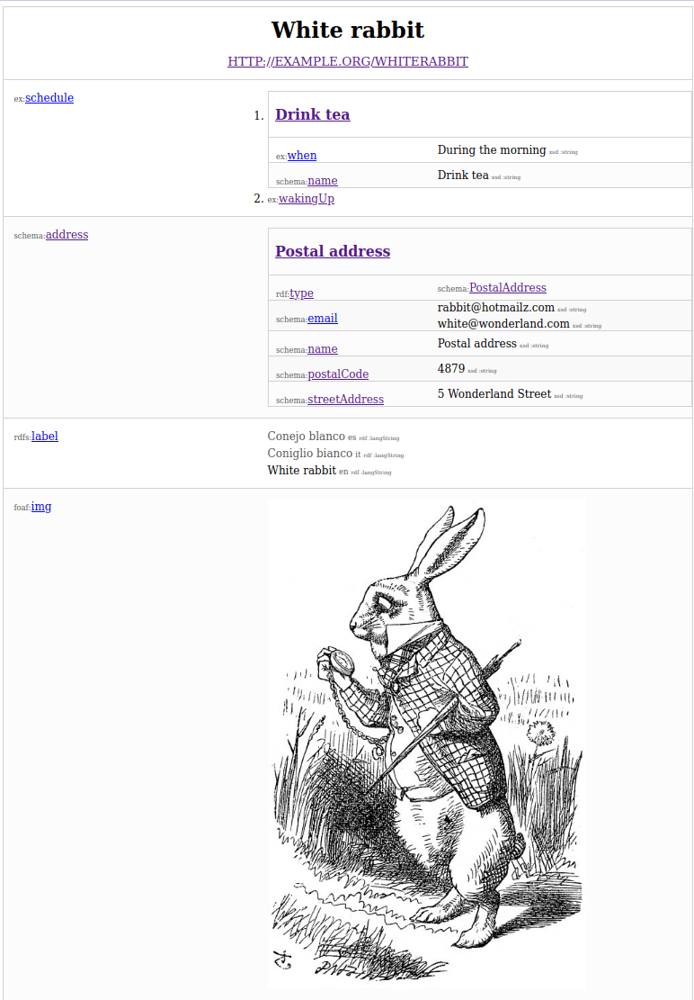

# rdf-entity-webcomponent

A Web component that visualizes a dataset in (simple) tabular formats

## Usage

The element requires a single property `dataset` which conforms to
the [rdf-dataset spec](https://rdf.js.org/dataset-spec/)

## Run the example

```
npm install
npm run dev
```

It will display something similar to:



See the [example](./index.html) for details

## Properties

| Property             | Attribute             | Modifiers | Type      | Default                  | Description                                                                                               |
|----------------------|-----------------------|-----------|-----------|--------------------------|-----------------------------------------------------------------------------------------------------------|
| `dataset`            | false                 |           | `Object`  | undefined                | A [rdf-dataset](https://rdf.js.org/dataset-spec/)                                                         |
| `terms`              | false                 |           | `Array`   | undefined                | An array of [rdf-terms](https://rdf.js.org/data-model-spec/#term-interface) to be displayed with priority |
| `technicalCues`      | `technical-cues`      |           | `Boolean` | false                    | Display information such as languages or datatypes                                                        |
| `compactMode`        | `compact-mode`        |           | `Boolean` | false                    | Group repeated properties or values for a compact visualization                                           |
| `preferredLanguages` | `preferred-languages` |           | `Array`   | ['en', 'fr', 'de', 'it'] | A list of the languages to show in the labels, ordered by priority                                        |
| `embedBlankNodes`    | `embed-named-nodes`   |           | `Boolean` | false                    | Recursively embeds any blank node positioned as an object                                                 |
| `embedNamedNodes`    | `embed-blank-nodes`   |           | `Boolean` | false                    | Recursively embeds any named entity positioned as an object                                               |
| `embedLists`         | `embed-lists`         |           | `Boolean` | false                    | Display rdf-lists as ordered lists                                                                        |
| `highlightLanguage`  | `highlight-language`  |           | `Boolean` | false                    | Highlights literals matching prefered language                                                            |
| `maxLevel`           | `max-level`           |           | `Number`  | 3                        | The maximum depth of the trees                                                                            |
